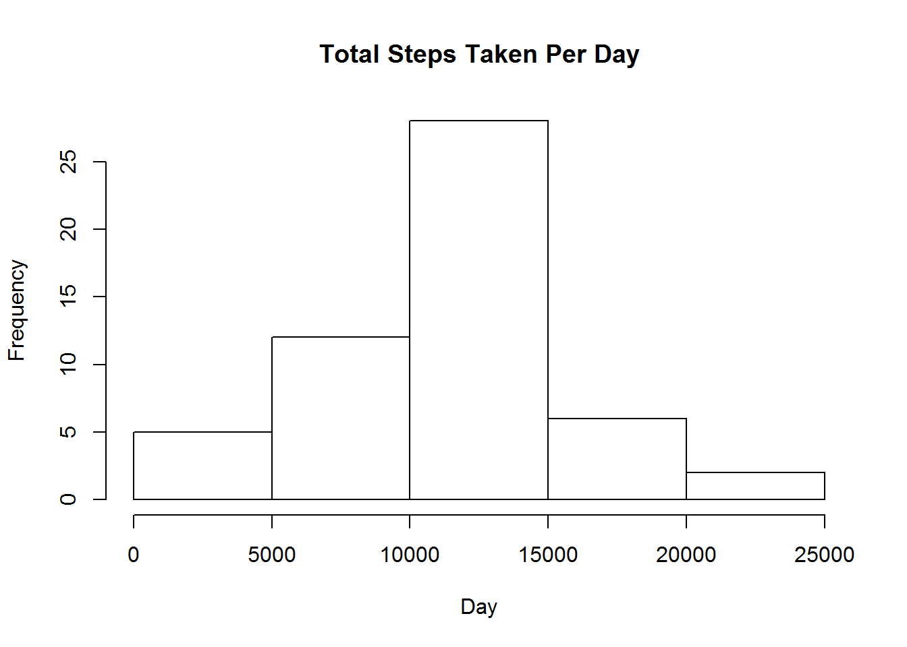
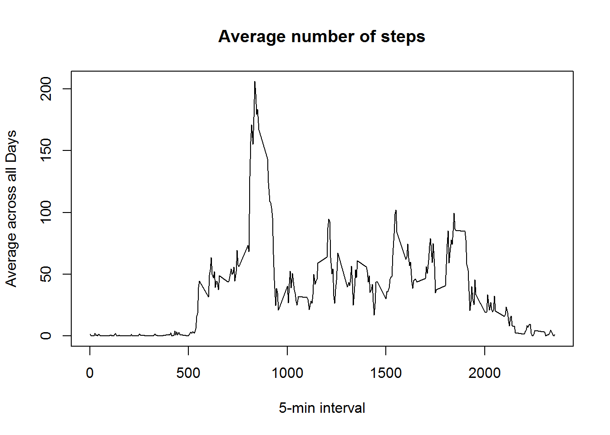
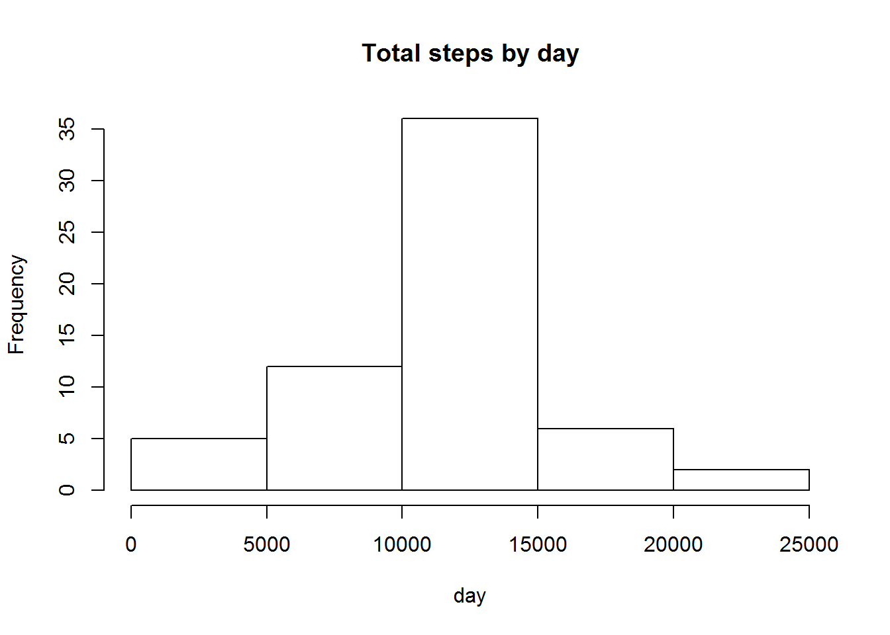
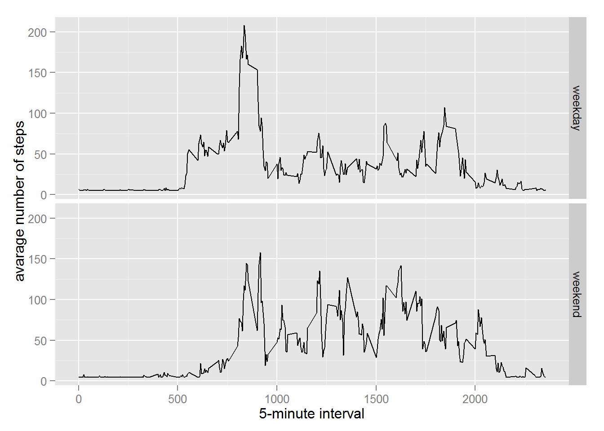

# Reproducible Research: Peer Assessment 1

## Loading and preprocessing the data

```r
setwd("C:\\Users\\Desktop\\R")
activitydata<-read.csv("C:\\Users\\Desktop\\R\\activity.csv")
library(lattice)
library(ggplot2)
activitydata$date<-as.Date(activitydata$date,"%Y-%m-%d")
```

## What is mean total number of steps taken per day?

```r
stepsTakenByDay<-aggregate(steps ~ date, data = activitydata, sum, na.rm = TRUE)
hist(stepsTakenByDay$steps,main = "Total Steps Taken Per Day",xlab = "Day")
```

 

```r
mean(stepsTakenByDay$steps)
```

```
## [1] 10766.19
```

```r
median(stepsTakenByDay$steps)
```

```
## [1] 10765
```


## What is the average daily activity pattern?

```r
timeseries <- tapply(activitydata$steps, activitydata$interval, mean, na.rm = TRUE)
plot(row.names(timeseries),timeseries,type = "l",xlab="5-min interval",
     ylab = "Average across all Days",main = "Average number of steps")
```

 


On average across all the days in the dataset, the 5-minute interval contains
the maximum number of steps?

```r
maxsteps <- which.max(timeseries)
names(maxsteps)
```

```
## [1] "835"
```


## Imputing missing values

There are many days/intervals where there are missing values (coded as `NA`). The presence of missing days may introduce bias into some calculations or summaries of the data.


```r
activitydata_NA <- sum(is.na(activitydata))
activitydata_NA
```

```
## [1] 2304
```


All of the missing values are filled in with mean value for that 5-minute
interval.


```r
# Replace each missing value with the mean value of its 5-minute interval
activitydataImputed <- activitydata
activitydataImputed$steps <- impute(activitydata$steps, fun = mean)
```

Now, using the filled data set, let's make a histogram of the total number of steps taken each day and calculate the mean and median total number of steps.


```r
stepsTakenByDay2 <- aggregate(steps ~ date, data = activitydataImputed, sum, na.rm = TRUE)
hist(stepsTakenByDay2$steps, main = "Total steps by day", xlab = "day")
```

 

```r
mean(stepsTakenByDay2$steps)
```

```
## [1] 10766.19
```

```r
median(stepsTakenByDay2$steps)
```

```
## [1] 10766.19
```


Mean and median values are higher after imputing missing data. The reason is
that in the original data, there are some days with `steps` values `NA` for 
any `interval`. The total number of steps taken in such days are set to 0s by
default. However, after replacing missing `steps` values with the mean `steps`
of associated `interval` value, these 0 values are removed from the histogram
of total number of steps taken each day.

## Are there differences in activity patterns between weekdays and weekends?
First, let's find the day of the week for each measurement in the dataset. In
this part, we use the dataset with the filled-in values.


Now, let's make a panel plot containing plots of average number of steps taken
on weekdays and weekends.

```r
activitydataImputed$dateType <-  ifelse(as.POSIXlt(activitydataImputed$date)$wday %in% c(0,6), 'weekend', 'weekday')
averagedactivityImputed <- aggregate(steps ~ interval + dateType, data=activitydataImputed, mean)
ggplot(averagedactivityImputed, aes(interval, steps)) + geom_line() + 
        facet_grid(dateType ~ .) + xlab("5-minute interval") + ylab("avarage number of steps")
```

 

